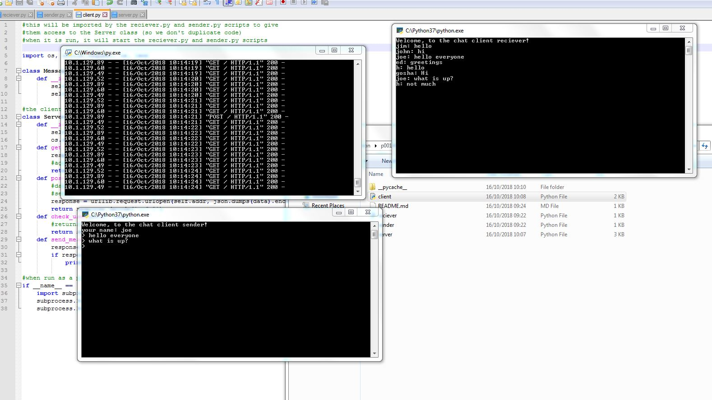
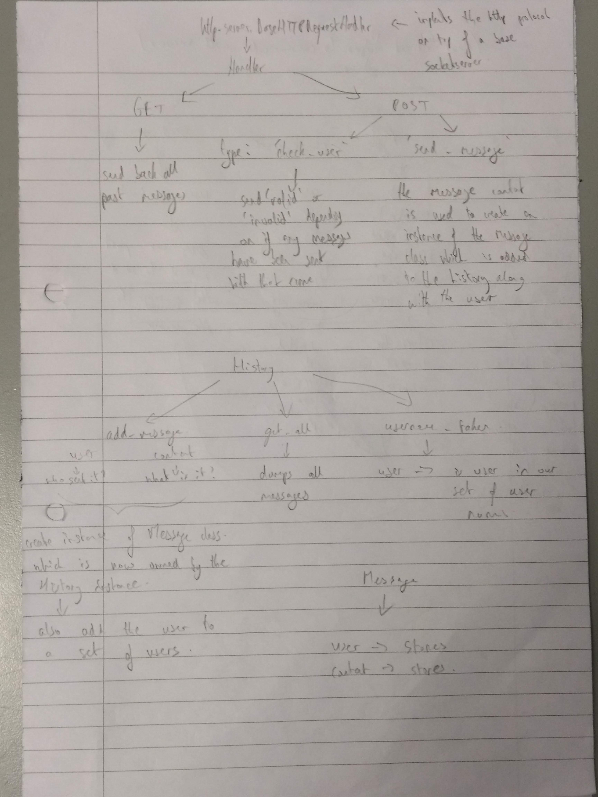
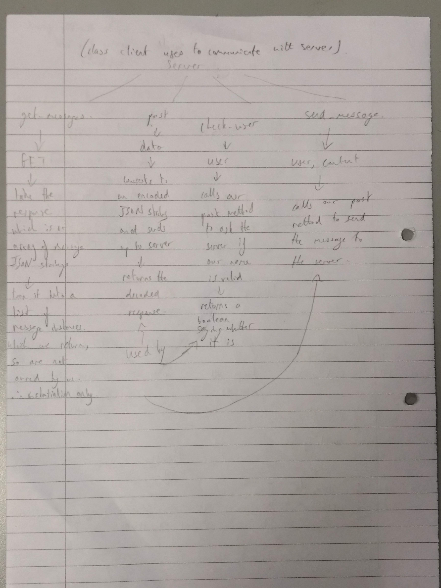
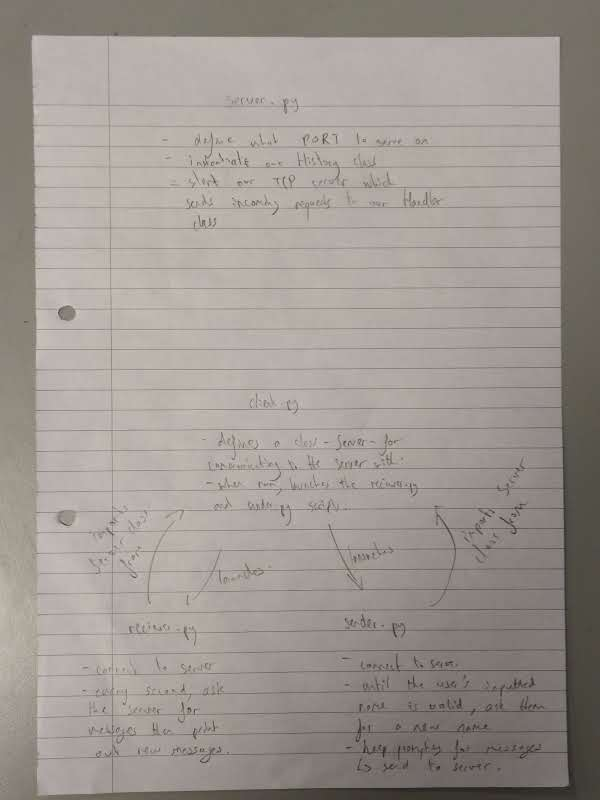
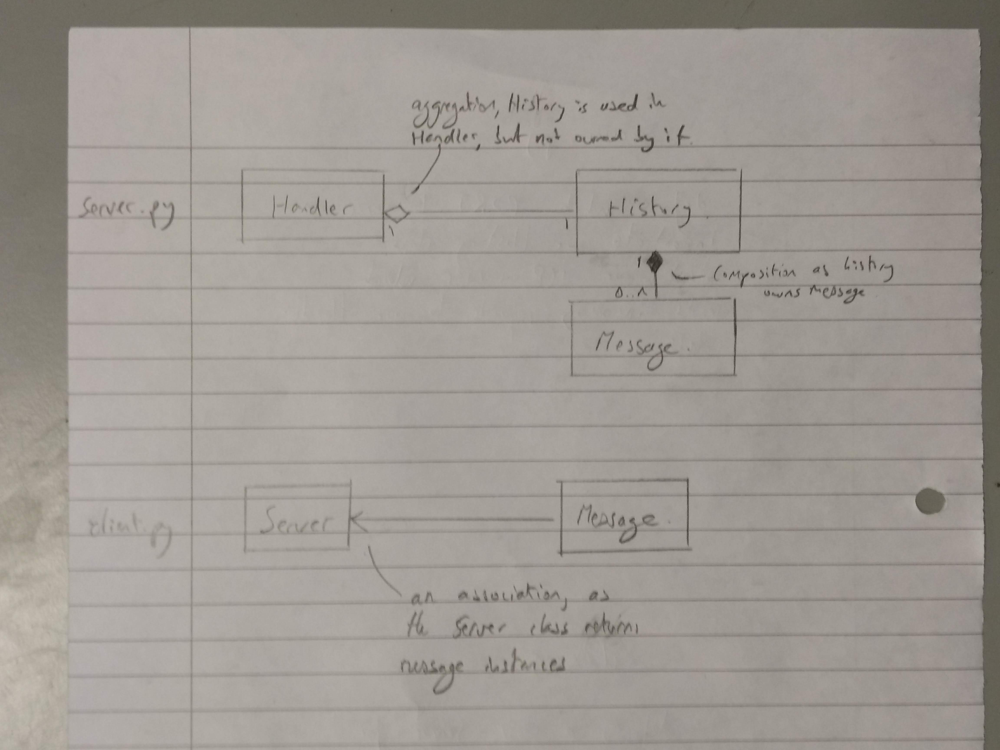

python chat
===========

### A small project done to practice OOP in A-Level ComSci

This project provides python scripts to host your own chat server.

To **serve** your own chat server, download the `server.py` script, modify the `PORT` variable to suit you and run it.

To **connect** to a chat server, download the `client.py`, `receiver.py` and `sender.py` scripts (click the green clone button, download zip, extract). Then modify the server url to match that of your server in the `client.py` script. Now run the `client.py` script which will launch those two other scripts.

It should then connect you over *http* to the server, allowing you to chat.

---

A preview of what it will look like:

Description of classes used by the server

Description of classes used by the client:

Overview of what each file does:

A class diagram:

